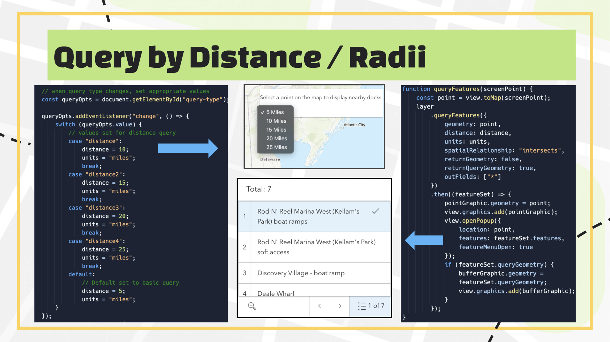
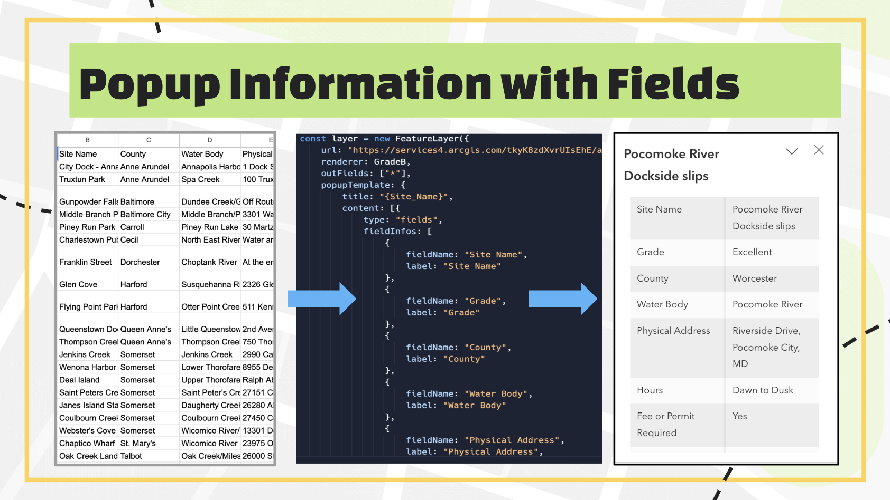

# Smithsonian Environmental Research Center Presents: Chesapeake Water Watch Docks Map

---

The Chesapeake Bay, the largest estuary in the United States, spans Maryland and Virginia and supports a rich and diverse ecosystem. Its plants and animals, however, have been negatively impacted by pollution and environmental changes. Water sampling provides critical insights into the health of the Chesapeake Bay ecosystem. This data helps scientists identify trends, assess threats, and implement effective conservation and restoration strategies. Chesapeake Watershed Watch (CWW) aims to help NASA optimize satellite algorithms to remotely monitor water quality in coastal ecosystems like the Chesapeake Bay. Volunteers play a crucial role in CWW’s research by collecting the data that makes this work possible. This map highlights over 160 dock locations surrounding the Chesapeake Bay, where water quality monitoring takes place, helping volunteers locate nearby stations to contribute to data collection.

ArcGIS JavaScript is a powerful web mapping technology that enables developers to create interactive, customizable maps, applications, and visualizations using Esri's geographic information system (GIS) capabilities. This map was built using HTML, JavaScript, and CSS.

---

## How It Works

  
  

Users can limit their search radius to between 5 and 25 miles around a chosen location, and the map displays results accordingly. Popups provide convenient access to detailed site information, including:

- **Site Name**  
- **Dock Grade**  
- **Contact Information**  
- **Google Maps Directions**  
- **Parking Information**  
- **Coordinates**
- and more

Additionally, station maintainers can update their dock information via a comma-separated Google Spreadsheet. Changes are reflected in real time, requiring no coding, making the system intuitive and user-friendly.

---

## Access Map Here
Navigate to the "Interactive Dock Map" tab.
https://serc.si.edu/chesapeake-water-watch/tips-data-collection 
